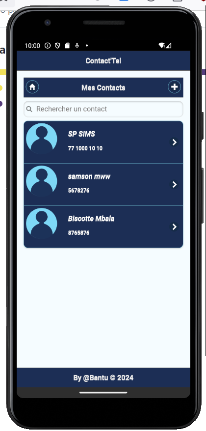
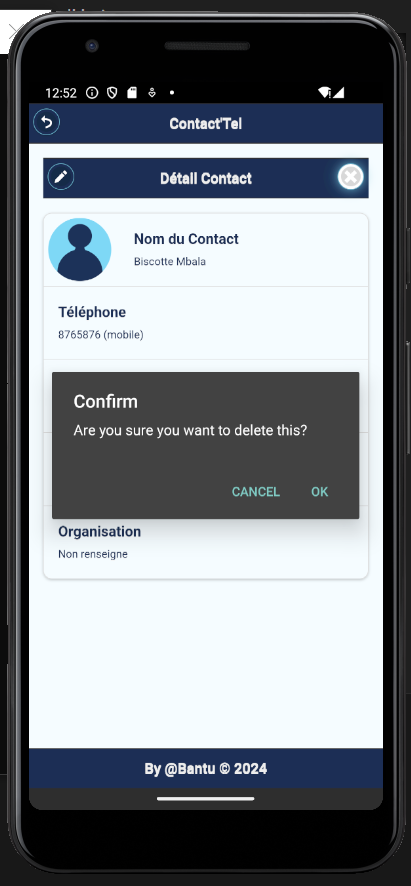
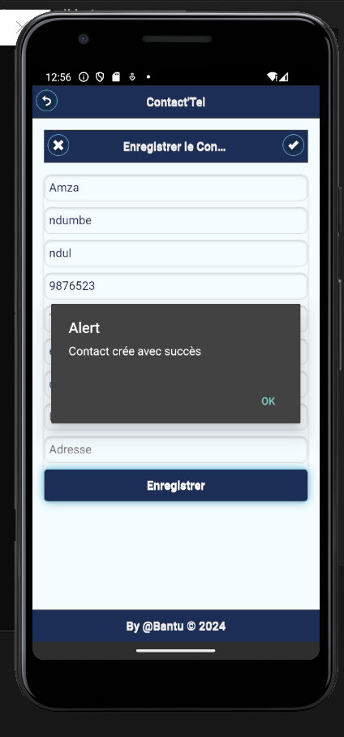
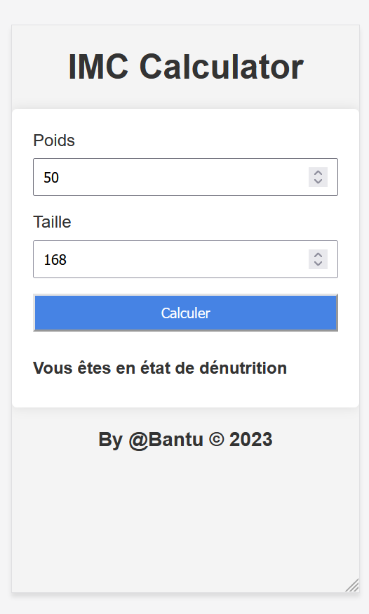

# **My Cordova projects**

## **Projects : 4**

> **Library for layout : Jquery mobile**

1. Contact'Tel (CRUD App with cordova-plugin-contact)
2. taskManager (fork of ToDo List with themeroller)
3. ToDo List (Basic App)
4. IMC Calculator (for mobile)

> ### ***1. Contact'Tel***
>
>>Features
>
>>> * Create contact
>>> * Read all contacts and their details
>>> * Modify contact infos
>>> * Delete Contact(s)
>>> * And themeroller tool for layout

   
   
   

> ### ***2. TaskManager***
>
>>Features
>
>>> * use themeroller for the layout and theme
>>> * Add tasks
>>> * swipe right the To Do tasks to move on Done tasks
>>> * swipe left the tasks to remove
>>> * swipe right the Done tasks to move on To Do tasks
>>> * And reset all tasks

   

> ### ***3. ToDo List***
>
>>Features
>
>>> * Add tasks
>>> * swipe right the To Do tasks to move on Done tasks
>>> * swipe left the tasks to remove
>>> * swipe right the Done tasks to move on To Do tasks
>>> * And reset all tasks

   

> ### ***4. Imc Calculator for mobile***
>
>>Features
>
>>> * Put size
>>> * Put weight
>>> * Calculate IMC

   